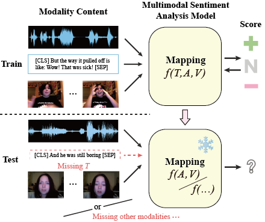
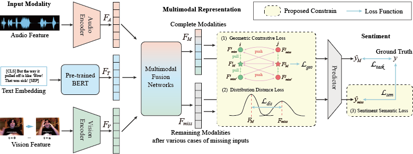

# MissModal

> Official Pytorch Implementation of "MissModal: Increasing Robustness to Missing Modality in Multimodal Sentiment Analysis"




## Table of Contents
- [Setup](#setup)
- [Download Datasets](#download-datasets)
- [Train](#train)
- [Acknowledgments](#acknowledgments)

## Setup
Python version >= 3.8
```bash
pip install -r requirement.txt
```

## Download Datasets
Provide public Multimodal Sentiment Analysis Datasets by Google Cloud Drive
[CMU-MOSI](#https://arxiv.org/abs/1606.06259): https://drive.google.com/drive/folders/1mGDZe5ZAcb3kmrQjvpCjANcS9Nq-nEvy
[CMU-MOSEI](#https://aclanthology.org/P18-1208): https://drive.google.com/drive/folders/1OTmRiJ00gG4u2JIujLpsJh-cJdVDLvXc
## Train


## Acknowledgments
We would like to express our gratitude to [huggingface](https://huggingface.co/) and [mmsa](https://github.com/thuiar/MMSA), which are of great help to our work.

